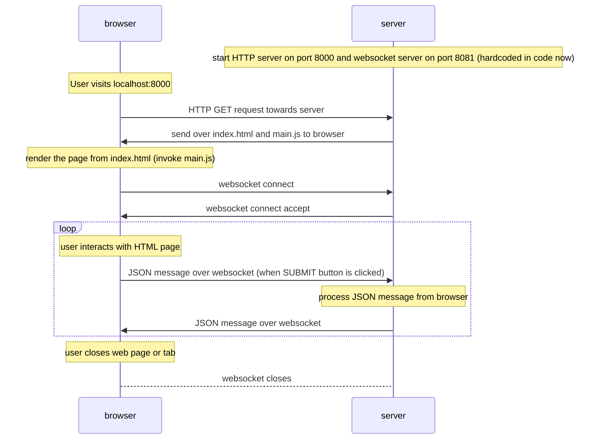

# Boilerplate web GUI with Python backend

Prototype implementation of a simple web HTML with a little Bootstrap frontend working with Python based web server with websocket.

## Components:

* `index.html`: simple webpage with Bootstrap. No css.
* `main.js`: javascript that handles the GUI update and websocket communication with backend
* `server.py`: simple Python backend that handles websocket server (no http server)
* `README.md`: this information file

## Execution:

All commands should be invoked from the source folder.

 * Launch http server on one terminal (default port 8000):

    `python -m http.server`

   Or:

    `python -m http.server <port number>`

* On the second terminal, launch Python backend websocket server (running on port 8081):

    `python server.py`

 * launch front end through browser **http://localhost:8000** (default), or the non-default `<port number>` specified in  `python -m http.server <port number>`.

## Interactions of components:

Sequence diagrams on how the components interact on a sample execution:

 
## Issues:

* In python there is no easy way for a single server to serve as HTTP and websocket server at the same time

* Never got Bootstrap dropdown list working

* How to do incrementally increase rows in `Results` table

